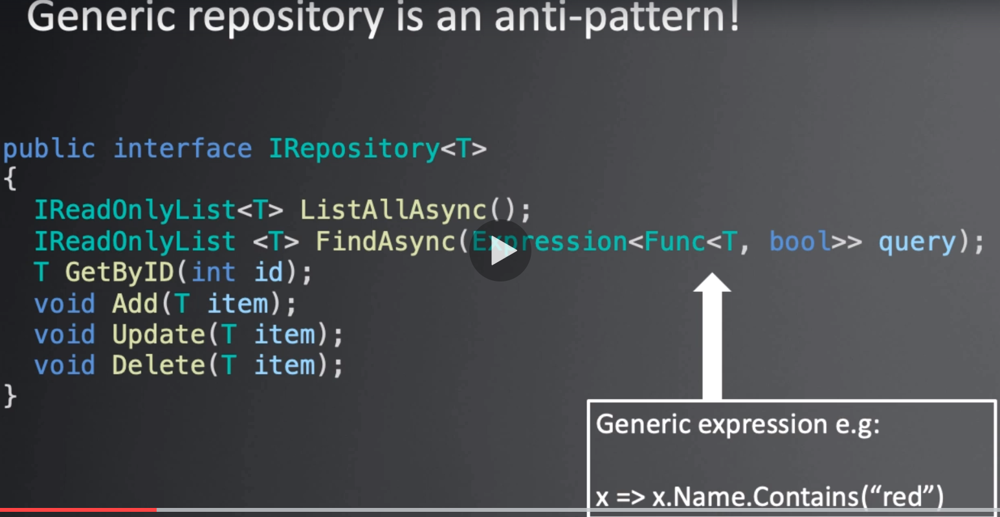
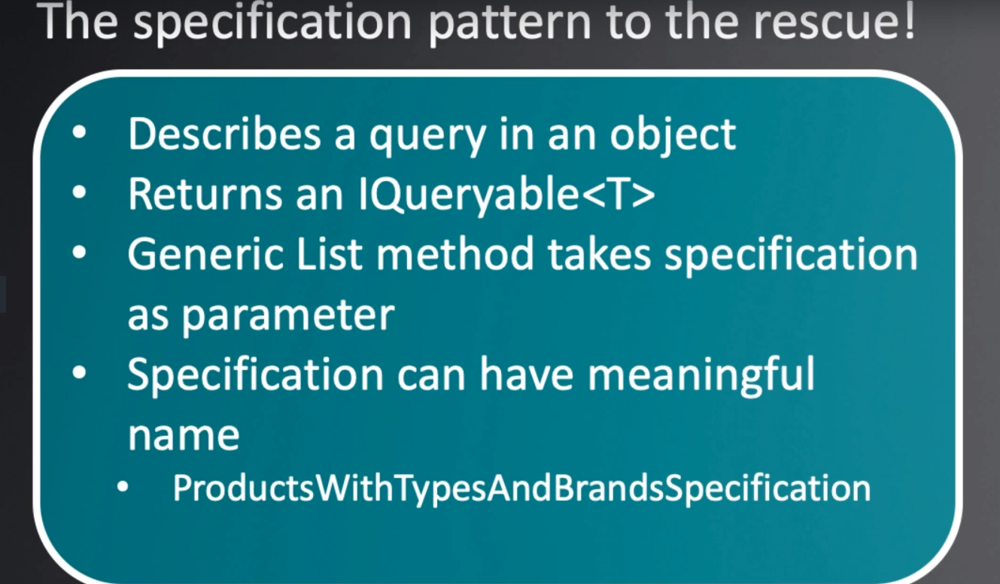
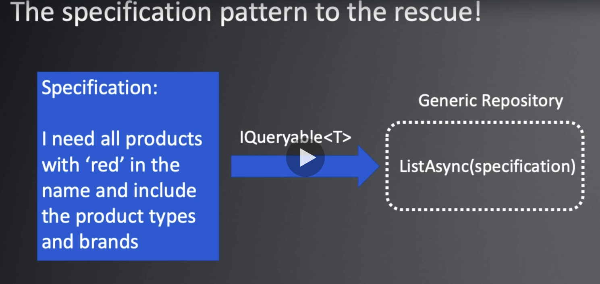
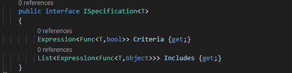
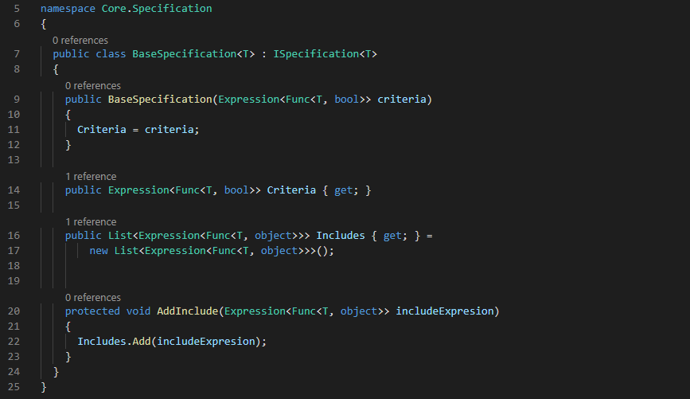
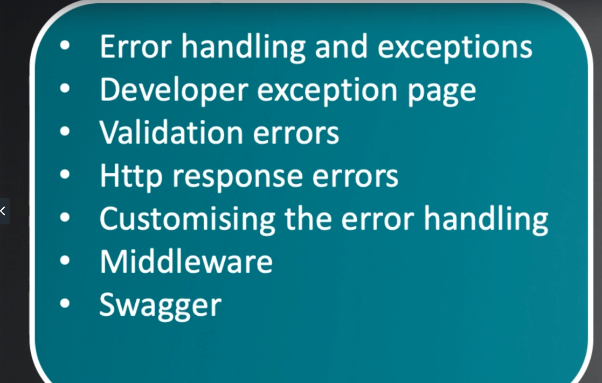
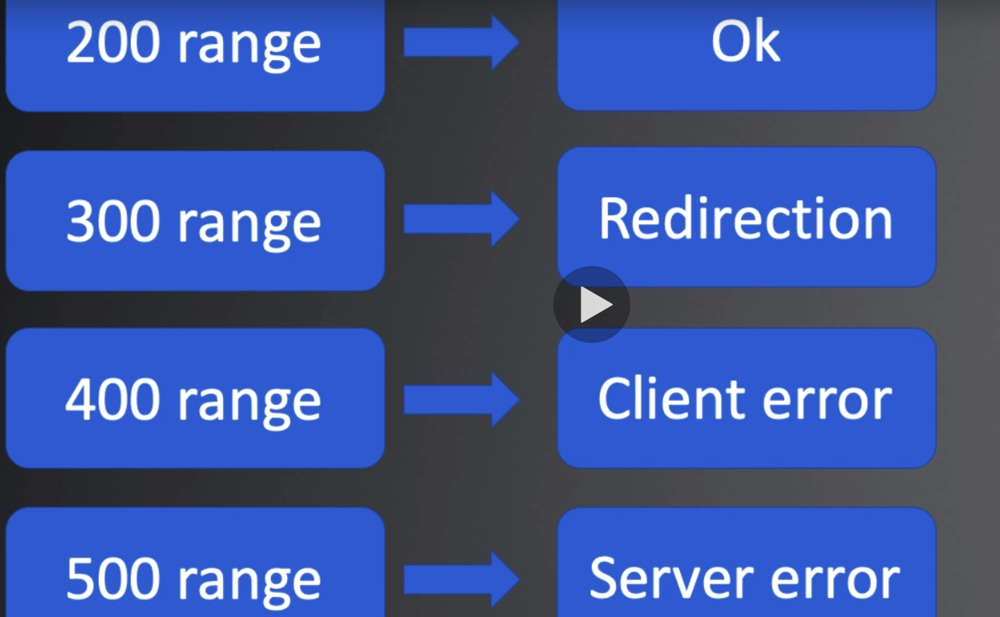

https://github.com/trycatchlearn/skinet 

 mkdir skinet

cd /c/Projects/waleryjasinski/learn-to-build-an-e-commerce-app-with-net-core-and-angular/skinet
cd c:\Projects\waleryjasinski\learn-to-build-an-e-commerce-app-with-net-core-and-angular\skinet 

dotnet new sln
dotnet new webapi -o API
dotnet sln add .\API\

F1 .NET generate assets for build and debug

dotnet dev-certs https -t

dotnet new classlib -o Core
dotnet new classlib -o Infrastructure

dotnet sln add .\Core\
dotnet sln add .\Infrastructure\
dotnet add reference ..\Core\

dotnet watch run 

dotnet ef  migrations add Init  -o .\Data\Migrations
dotnet ef database update

root 
dotnet ef database drop -p Infrastructure -s API
dotnet ef migrations remove -p .\Infrastructure\ -s .\API\
dotnet ef migrations add InitialCreate -p .\Infrastructure\ -s .\API\ -o Data/Migrations

dotnet ef database update

git add .
git commit -m "enf of section 4"
git push origin master 

git clone https://github.com/waleryjasinski/Skinet.git

ng new client 
routing Y 
SCSS
ng serve
